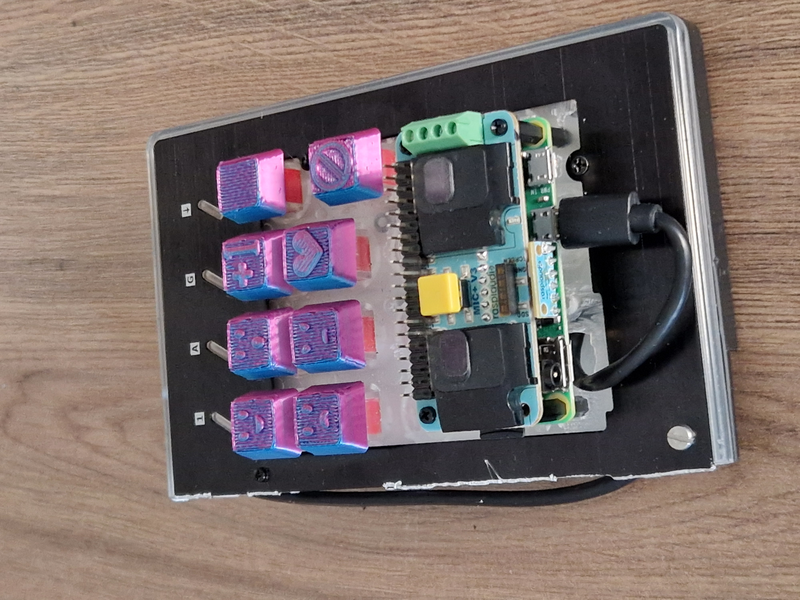

# DnD Soundboard

The DnD soundboard is a small keyboard connected to a raspberry pi zero 2 w.
The raspberry pi responds to keypresses and play samples.




## Usage


### Keys

There are 8 buttons on the soundboard, in normal function, 6 of these are used
to play samples and one is used to stop all playback. There is a function key
that enables alternative function of the buttons so that different sample banks
may be selected, volume adjusted or loop mode enabled/disabled. The following
tables shows the buttons and their functionality.

**Normal key behaviour**:
| | | | |
| --- | --- | --- | --- |
| Sample 1 |  Sample 2 | Sample 3  | Function key |
| Sample 4 |  Sample 5 | Sample 6  | Stop playback (hold 5 seconds to shut down device) |

**Function key is pressed**:
| | | | |
| --- | --- | --- | --- |
| Bank 1 |  Bank 2 | Volume up  |  |
| Bank 3 |  Bank 4 | Volume down | oneshot/loop mode |


### Playback

All samples in a single bank can be played at the same time, but when a bank is
switched, the sounds from the previous bank are stopped and samples from the
new bank are loaded.

When a sample is played in oneshot mode (default), the sample plays one time
until the end. If the sample-button is pressed again, the sample is stopped and
played again from the start. I loop mode is enabled (press function key and
stop key together) a light turns on and samples are played in a loop until the
key is released.


### Loading samples

The soundboard hosts a samba network drive for the sample directory. This can
be used to load new samples. The software expects one directory for each bank,
and a number before each sample to specify the sample number. Following is an
example of a correct layout:

```
samples/
├── bank_1
│   ├── 1-ride.wav
│   ├── 2-crash.wav
│   ├── 3-open-hat.wav
│   ├── 4-kick.wav
│   ├── 5-clap.wav
│   └── 6-closed-hat.wav
└── bank_2
    ├── 1-horse.wav
    ├── 2-oof.wav
    ├── 3-tom-jerry.wav
    ├── 4-sword.wav
    ├── 5-brass.wav
    └── 6-guitar.wav
```

The software currently only supports `.wav` files.

To load the new samples to the unit, select the bank with the samples, and
they will be loaded.


## Hardware

I found an old mechanical keyboard (a [Thura GXT 860](https://www.trust.com/en/product/21842))
in the electrical trash and that inspired this project. I cut the keyboard so
that only the numpad is left and removed some keys so that there was space for
the [Raspberry Pi Zero 2 W](https://www.raspberrypi.com/products/raspberry-pi-zero-2-w/)
that is used to recieve keypresses and play the sounds. The [raspiaudio MIC+](https://raspiaudio.com/product/mic/)
board provides a soundcard and speakers to the system.

## Software

The `python/keyboard_controller.py` program listens to keypresses from the
keyboard, and sends commands to STDOUT. This program should have access to
input events from the keyboard (e.g. by running as root).

The `python/play_sounds.py` program listen to STDIN and play sounds
corresponding to the commands. SDL2 is used to make sound control efficient.

These programs should be run with and communicate through systemd services on
the raspberry pi. For testing, the following command can be used to run the
software:

```sh
sudo python3 python/keyboard_controller.py | python3 python/play_sounds.py
```

There is a preconfigured NixOS image for Raspberry Pi Zero 2 W with the
soundboard software installed and set up. See [nix](./nix/README.md) for more
information on this.
